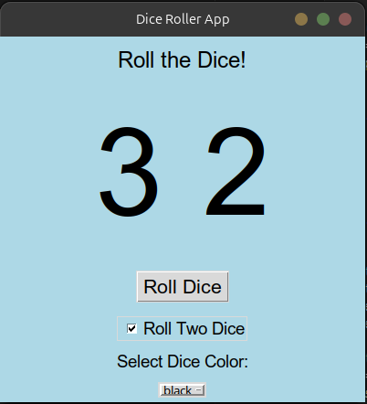

# Dice Roller App

A fun and interactive graphical dice roller app built with Python and Tkinter. This app simulates rolling one or two dice with a smooth rolling animation and allows customization of the dice color.

## Features

- **Roll One or Two Dice**: Choose between rolling a single die or two dice simultaneously, ideal for games like backgammon.
- **Smooth Rolling Animation**: Experience a brief animation that mimics the real rolling of dice.
- **Color Customization**: Select the color of the dice numbers (options include black, red, blue, green, and purple).
- **Simple and Clean UI**: A user-friendly interface with intuitive controls.

## Screenshots



## Installation

1. **Clone the Repository:**
   ```bash
   git clone https://github.com/hiddent3erminal/Python-Dice-GUI.git
   cd dice-roller-app
   ```

2. **Run the App:**
   Make sure Python is installed on your system, then run:
   ```bash
   python3 dice_app.py
   ```

3. **Install Tkinter (if needed):**
   On Ubuntu or Debian-based systems, you can install Tkinter using:
   ```bash
   sudo apt update
   sudo apt install python3-tk
   ```

## How to Use

1. **Start the app** by running the script.
2. **Choose your options:**
   - Select whether to roll one or two dice by checking the "Roll Two Dice" option.
   - Pick a dice color from the dropdown menu.
3. **Click "Roll Dice"** and watch the smooth rolling animation reveal the final dice result.

## Requirements

- Python 3.x
- Tkinter (usually comes pre-installed with Python)

## Project Structure
```
.
├── dice_app.py   # Main Python script for the dice roller app
└── README.md     # Project documentation (this file)
```

## Contributing

Contributions are welcome! Feel free to open issues or submit pull requests to improve the app.

## License

This project is licensed under the MIT License. See the [LICENSE](LICENSE) file for details.

## Acknowledgments

- **Tkinter**: For providing the GUI framework.
- **Python**: For making development fun and accessible.

---
Enjoy rolling the dice! 🎲

